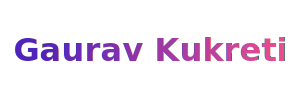

# Hey! 👋

B.Tech CSE 3rd year

## 🛠 Technologies and tools

[][tech_tools_anchor]
&nbsp;
[][tech_tools_anchor]
&nbsp;
[][tech_tools_anchor]
&nbsp;
[][tech_tools_anchor]
&nbsp;
[][tech_tools_anchor]
&nbsp;
[][tech_tools_anchor]
&nbsp;
[][learning_next_anchor]
&nbsp;

## 📖 What I am currently learning / improving on

[][tech_tools_anchor]
&nbsp;

challenge: I am doing the #100DaysOfCode challenge focused on Data Structures and Algorithms.

## 👾 What I am interested in learning at some point

[][tech_tools_anchor]
&nbsp;
[][learning_next_anchor]
&nbsp;
[][learning_next_anchor]
&nbsp;
[][learning_next_anchor]
&nbsp;
[][learning_next_anchor]

[tech_tools_anchor]: #bonjour--
[learning_now_anchor]: #learning-now
[learning_next_anchor]: #learning-next
